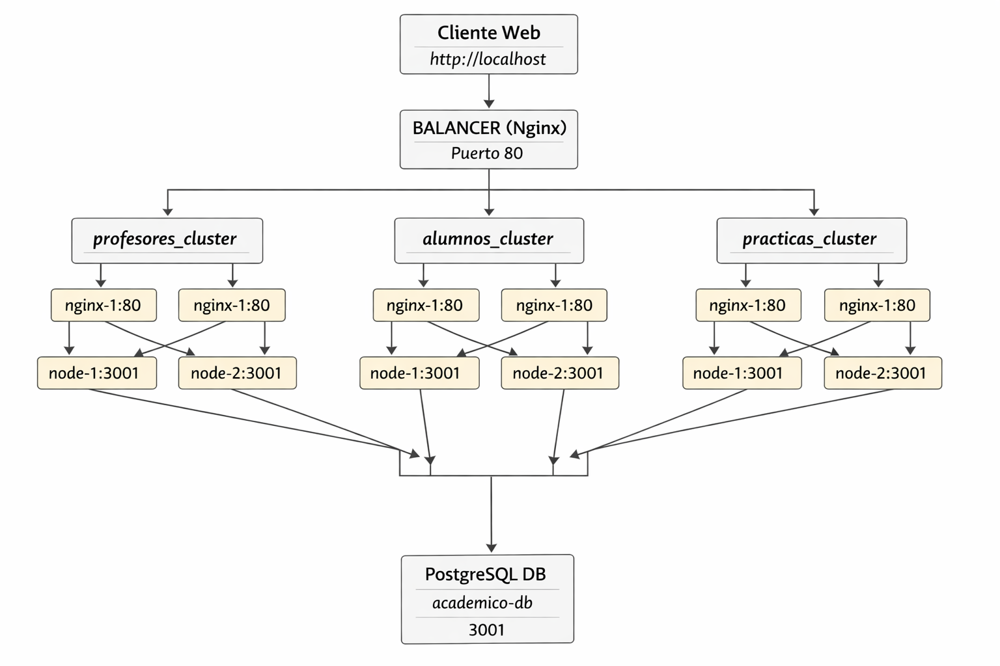

# Proyecto Académico -- Arquitectura Distribuida con Contenedores Docker

## 1. Descripción General

Este proyecto implementa una arquitectura distribuida basada en
contenedores Docker, diseñada bajo criterios de:

-   Separación de responsabilidades
-   Alta disponibilidad
-   Balanceo de carga multinivel
-   Escalabilidad horizontal
-   Red interna aislada

La solución está compuesta por:

-   1 Base de datos PostgreSQL
-   3 microservicios Node.js (Profesores, Alumnos, Prácticas)
-   2 réplicas por microservicio
-   1 Nginx por cada réplica (mapeo 1:1)
-   1 balanceador principal Nginx
-   1 red interna común

------------------------------------------------------------------------

# 2. Arquitectura General

## 2.1 Esquema de Comunicaciones



------------------------------------------------------------------------

# 3. Red Docker

Todos los contenedores pertenecen a la red:

    academico-net

Características:

-   Tipo: bridge
-   Comunicación interna por nombre de servicio
-   Ningún contenedor Node expone puertos al host
-   Solo el balanceador principal publica el puerto 80

------------------------------------------------------------------------

# 4. Base de Datos

Servicio: academico-db\
Imagen: postgres:15

Características:

-   Inicialización automática mediante init_db.sql
-   Esquema: academico
-   Usuario aplicación: backend
-   Permisos completos sobre tablas y secuencias

Variables de conexión:

DB_HOST=academico-db\
DB_USER=backend\
DB_PASSWORD=ContraseñaSegura123\
DB_NAME=academico\
PORT=3001

------------------------------------------------------------------------

# 5. Microservicios

Cada dominio funcional dispone de su propio servicio:

  Servicio     Archivo         Función
  ------------ --------------- ------------------------
  Profesores   profesores.js   Gestión de asignaturas
  Alumnos      alumnos.js      Gestión de alumnos
  Prácticas    practicas.js    Gestión de prácticas

Características:

-   Node.js 22
-   Puerto interno 3001
-   Stateless
-   CRUD completo

------------------------------------------------------------------------

# 6. Arquitectura de Balanceo

## Nivel 1 -- Balanceador Principal

Servicio: balancer

Define 3 upstream:

-   profesores_cluster → profesores-nginx-1:80
-   profesores_cluster → profesores-nginx-2:80

-   alumnos_cluster → alumnos-nginx-1:80
-   alumnos_cluster → alumnos-nginx-2:80

-   practicas_cluster → practicas-nginx-1:80
-   practicas_cluster → practicas-nginx-2:80
------------------------------------------------------------------------

## Nivel 2 -- Balanceo Interno 1:2

profesores-nginx-1 → profesores-node-1:3001\
profesores-nginx-1 → profesores-node-2:3001\
profesores-nginx-2 → profesores-node-1:3001\
profesores-nginx-2 → profesores-node-2:3001

alumnos-nginx-1 → alumnos-node-1:3001\
alumnos-nginx-1 → alumnos-node-1:3001\
alumnos-nginx-2 → alumnos-node-1:3001\
alumnos-nginx-2 → alumnos-node-2:3001

practicas-nginx-1 → practicas-node-1:3001\
practicas-nginx-1 → practicas-node-1:3001\
practicas-nginx-2 → practicas-node-1:3001\
practicas-nginx-2 → practicas-node-2:3001

------------------------------------------------------------------------

# 7. Flujo de una Petición

1.  Cliente accede a http://localhost\
2.  Petición llega al balancer\
3.  Se redirige al cluster correspondiente\
4.  Nginx interno reenvía a cluster de Node\
5.  Node consulta PostgreSQL\
6.  Respuesta vuelve al cliente

------------------------------------------------------------------------

# 8. Alta Disponibilidad

-   Caída de un Node → otro responde\
-   Caída de un Nginx interno → balancer redirige\
-   Escalabilidad horizontal posible

Arquitectura: L7 → L7 → Aplicación

------------------------------------------------------------------------

# 9. Funcionalidades

-   CRUD completo
-   Relaciones N:M
-   Integridad referencial
-   Portal central index.html

------------------------------------------------------------------------

# 10. Despliegue

## Construcción y arranque

docker-compose up --build -d

# 11 Arranque / Parada

## Arranque

docker-compose -p ufv_nginx up -d

## Parada

docker-compose -p ufv_nginx down

# 12. Acceso a la web

http://localhost

------------------------------------------------------------------------

# 14. Disaster Recovery Plan (DRP) – Proyecto Académico Docker

## 14.1 Objetivo

Garantizar la continuidad del servicio protegiendo **solo los datos críticos** de PostgreSQL (`academico`).
Los microservicios Node.js y Nginx son **stateless**, versionados en Git y se reconstruyen automáticamente.

---

## 14.2 Alcance

- **Base de datos PostgreSQL** → datos críticos.  
- **Microservicios Node.js y Nginx** → stateless, no requieren backup.  
- **Contenido público (`./public`) y configuración Nginx** → versionados en Git, se restauran al levantar contenedores.

---

## 14.3 SLA DRP

| Parámetro | Valor |
|-----------|-------|
| **RTO (Recovery Time Objective)** | 1 hora |
| **RPO (Recovery Point Objective)** | 4 horas (máximo de datos perdidos desde último backup) |

---

## 14.4 Scripts de Backup y Restauración

Los scripts se encuentran en la carpeta `DRP/` en la raíz del proyecto:

| Script | Sistema | Función |
|--------|--------|---------|
| `DRP/backup_restore_linux.sh` | Linux/macOS | Backup y restauración de datos PostgreSQL |
| `DRP/backup_restore_windows.ps1` | Windows PowerShell | Backup y restauración de datos PostgreSQL |

### 14.4.1 Backup

**Linux / macOS:**

```bash
cd DRP
./backup_restore_linux.sh backup
```

**Windows PowerShell:**

```powershell
cd DRP
.\backup_restore_windows.ps1 backup
```

- El script generará un archivo de backup `backup_YYYY-MM-DD_HH-MM.sql` con **solo los datos** (`-a`).  
- Guardar este archivo fuera del host principal (NAS, unidad externa, nube).

**Política de backups para cumplir con el DRP:**

- Realizar backups automáticos cada 4 horas para cumplir con el RPO.
- Mantener al menos 7 días de backups históricos.
- Verificar semanalmente la integridad de los backups restaurando en un entorno de prueba.


### 14.4.2 Restauración

**Linux / macOS:**

```bash
cd DRP
./backup_restore_linux.sh restore <archivo_backup.sql>
```

**Windows PowerShell:**

```powershell
cd DRP
.\backup_restore_windows.ps1 restore <archivo_backup.sql>
```

- Solo se insertan los datos, sin recrear tablas ni esquemas, evitando conflictos.

---

## 14.5 Procedimiento de Recuperación DRP

1. **Clonar el repositorio del proyecto y entrar en él:**

```bash
git clone https://<repo-url>.git
cd <repo>
```

2. **Levantar la plataforma completa:**

```bash
docker-compose up -d --build
```

- Esto inicia microservicios, Nginx internos y balanceador principal.  
- El contenedor de PostgreSQL estará disponible, aunque vacío si es un host nuevo.

3. **Restaurar datos desde backup:**

- Linux/macOS:  
```bash
DRP/backup_restore_linux.sh restore DRP/backup_YYYY-MM-DD_HH-MM.sql
```

- Windows PowerShell:  
```powershell
DRP\backup_restore_windows.ps1 restore DRP\backup_YYYY-MM-DD_HH-MM.sql
```

4. **Validación:**

```bash
docker exec -it academico-db psql -U backend -d academico -c "\dt"
```

- Acceder a la aplicación: `http://localhost`.  
- Verificar que microservicios (`/profesores`, `/alumnos`, `/practicas`) funcionan y que los datos están correctos.

---

## 14.6 Procedimiento de Pruebas DRP

1. Simular fallo del contenedor PostgreSQL.  
2. Levantar contenedor vacío y restaurar datos con los scripts.  
3. Medir **RTO** (≤1 hora) y **RPO** (≤4 horas).  
4. Simular fallo de microservicios o Nginx y reconstruir contenedores:

```bash
docker-compose up -d <servicio>
docker logs -f <servicio>
```

5. Documentar resultados de la prueba.

---

## 14.7 Notas Importantes

- Solo se respalda **la información crítica**: los datos de PostgreSQL.  
- Microservicios y Nginx son **stateless**, reconstruibles desde Docker/Git.  
- Los scripts son **cross-platform**: Linux/macOS y Windows PowerShell.  
- Mantener backups fuera del host principal para **fallos totales**.  
- En DR completo: levantar contenedores con `docker-compose up -d` y luego ejecutar el restore.

